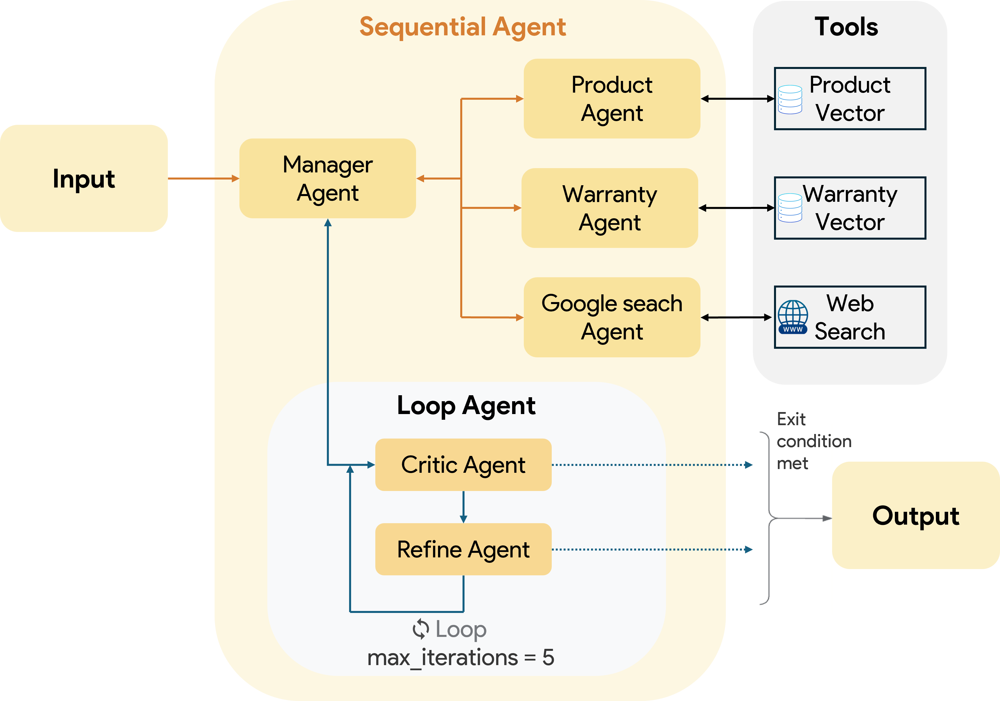

# Multi-Agent Agentic RAG Systems

---


_Sơ đồ tổng quan về Hệ thống Đa Tác Tử Agentic RAG_

---

## Cài đặt

1.  **Clone Repo:**
    ```bash
    git clone https://github.com/qxuanson/multi-agents-agentic-rag
    cd multi-agent-agentic-rag
    ```
    *(Thay thế `TEN_NGUOI_DUNG_CUA_BAN/TEN_KHO_LUU_TRU_CUA_BAN` bằng URL kho lưu trữ GitHub của bạn)*

2.  **Cài đặt thư viện:**
    ```bash
    pip install -r requirements.txt
    ```

3.  **Set Up Environment Variables (Thiết lập Biến Môi trường):**
    Nhiều thành phần (đặc biệt là LLMs và Vector Stores) yêu cầu API keys hoặc các thông tin cấu hình khác.
    Tạo một tệp `.env` trong thư mục gốc của dự án.
    Ví dụ tệp `.env`:
    ```env
    GOOGLE_API_KEY="YOUR_GOOGLE_API_KEY"
    ```

4.  **Chạy Ứng dụng:**
    Chạy google adk:
    ```bash
    adk web
    ```
    Ở giao diện google adk chọn agent-demo
