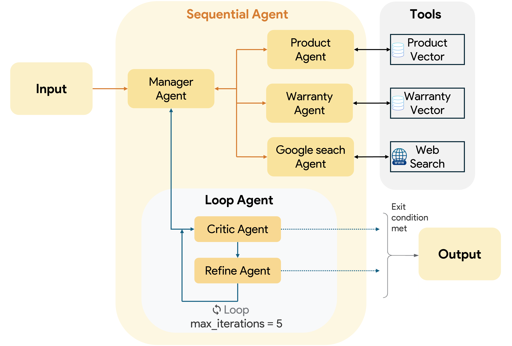

# Multi-Agent Agentic RAG Systems

---


_Sơ đồ tổng quan về Hệ thống Đa Tác Tử Agentic RAG_

---

## Cài đặt

1.  **Clone Repo:**
    ```bash
    git clone https://github.com/qxuanson/multi-agents-agentic-rag
    cd multi-agent-agentic-rag
    ```

2.  **Cài đặt thư viện:**
    ```bash
    pip install -r requirements.txt
    ```

3.  **API Key:**
    Tạo một tệp `.env` trong thư mục gốc của dự án và trong thư mục `agent-demo`.
    ```env
    GOOGLE_API_KEY="YOUR_GOOGLE_API_KEY"
    ```

4.  **Chạy Ứng dụng:**
    Chạy google adk:
    ```bash
    adk web
    ```
    Ở giao diện google adk chọn agent-demo
